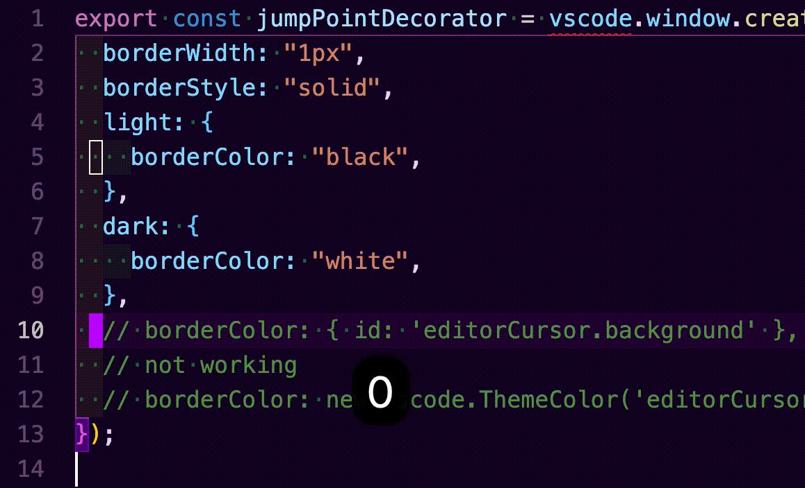

# Jet Cursor

Hilight realtive N line up and N line down from cursor position.
Enhancement moving command of vim's `{N}j` and `{N}k`.


## Recommend Config

example with [vscodevim](https://marketplace.visualstudio.com/items?itemName=vscodevim.vim)

`.vsvimrc`

```
nnoremap <C-j> 5j
nnoremap <C-k> 5k
vnoremap <C-j> 5j
vnoremap <C-k> 5k
```

## Extension Settings

This extension contributes the following settings:

**WIP**

- `jetCursor.distance`: Distance of marker.
- `jetCursor.mode`: Hilight pattern `point` or `line`.

```
  "jetCursor.distance": 5
  "jetCursor.mode": "point"
```

<!-- ## Known Issues

Calling out known issues can help limit users opening duplicate issues against your extension. -->

## Commands

**WIP**

- `extension.jetCursor.toggle`: Toggle jetCursor on/off

## Release Notes

Users appreciate release notes as you update your extension.

### 1.0.0

Initial release of Base feature.
